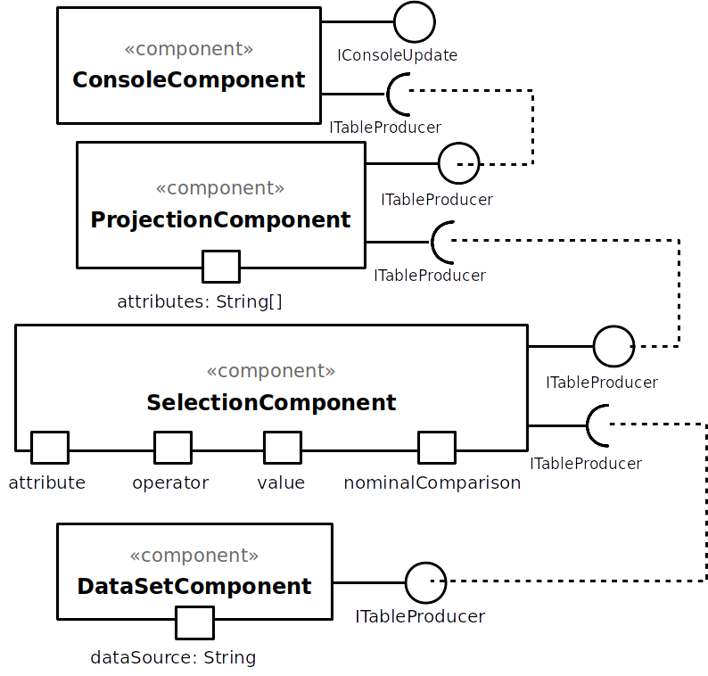
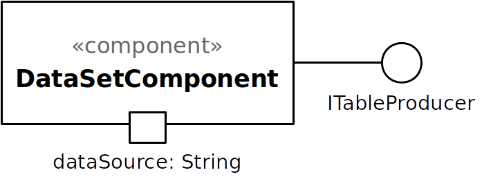
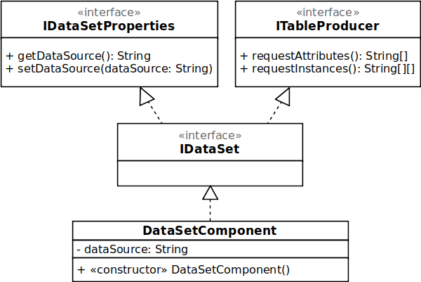

# Modelo para Documentação de um Componente

O vídeo a seguir apresenta um detalhamento de um projeto baseado em componentes:

Este é um guia de como produzir documentação em Markdown. Para entender como criar documentos em Markdown no Github, veja o material/vídeo:
[Guia de Uso do Markdown](http://mc-unicamp.github.io/oficinas/docs/).

Vide detalhes sobre o Markdown em: [Mastering Markdown](https://guides.github.com/features/mastering-markdown/).

E mais especificamente sobre tabelas em: [Organizing information with tables](https://help.github.com/en/articles/organizing-information-with-tables)

Segue abaixo o modelo de como deve ser documentado o projeto e cada componente do projeto. Tudo o que for indicado entre `<...>` indica algo que deve ser substituído pelo indicado. No modelo são colocados exemplos ilustrativos, que serão substituídos pelos do seu projeto.

Para a construção dos diagramas, devem ser usados modelos disponíveis em: [Diagramas de Classes, Interfaces e Componentes](https://docs.google.com/presentation/d/1ML3WrnDtzh-4wqLmdXN9au1TBIwEqo7TIbMLNOYSMAI/edit?usp=sharing)

# Modelo para Documentação do Projeto

# Projeto `<Título>`

# Equipe
* `<nome completo>` - `<RA>`

# Descrição Resumida do Projeto
`<descreva resumidamente o que fará o projeto>`

# Vídeo do Projeto
`<coloque um link para o vídeo do projeto, se houver>`

# Diagrama Geral de Componentes

## Exemplo 1

Este é o diagrama compondo componentes para análise:

## Exemplo 2

Este é um diagrama inicial do projeto de jogos:

## Exemplo 3

Este é outro diagrama de um projeto de vendas:

Para cada componente será apresentado um documento conforme o modelo a seguir:

# Componente `<Nome do Componente>`

## Interfaces

Interfaces associadas a esse componente:

Campo | Valor
----- | -----
Classe | `<caminho completo da classe com pacotes>`   Exemplo: `pt.c08componentes.s20catalog.s10ds.DataSetComponent`
Autores | `<nome dos membros que criaram o componente>`
Objetivo | `<objetivo do componente>`
Interface | `<interface em Java do componente>`
~~~
public interface ITableProducer {
  String[] requestAttributes();
  String[][] requestInstances();
}
public interface IDataSource {
  public String getDataSource();
  public void setDataSource(String dataSource);
}
public interface IDataSet extends ITableProducer, IDataSource {
}
~~~

## Detalhamento das Interfaces

### Interface `<nome da interface>`
`<papel da interface>`.

Método | Objetivo
-------| --------
`<id do método em Java>` | `<objetivo do método e descrição dos parâmetros>`

## Exemplo:

### Interface `ITableProducer`

Interface provida por qualquer fonte de dados que os forneça na forma de uma tabela.

Método | Objetivo
-------| --------
`requestAttributes` | Retorna um vetor com o nome de todos os atributos (colunas) da tabela.
`requestInstances` | Retorna uma matriz em que cada linha representa uma instância e cada coluna o valor do respectivo atributo (a ordem dos atributos é a mesma daquela fornecida por `requestAttributes`.

### Interface `IDataSetProperties`

Define o recurso (usualmente o caminho para um arquivo em disco) que é a fonte de dados.

Método | Objetivo
-------| --------
`getDataSource` | Retorna o caminho da fonte de dados.
`setDataSource` | Define o caminho da fonte de dados, informado através do parâmetro `dataSource`.
